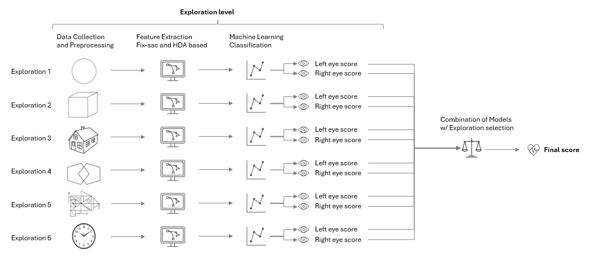
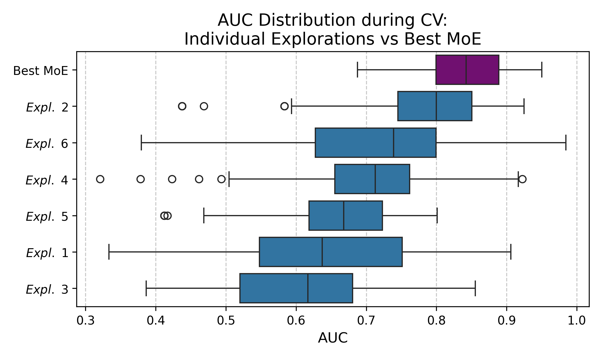

# Automatic Screening of Parkinson's Disease From Visual Explorations

Code accompanying the paper *Automatic Screening of Parkinson's Disease From Visual Explorations*. Eye-tracking recordings of participants freely exploring six structured images are turned into fixation/saccade and gaze-clustering (HDA) features, screened per exploration with an SVM, and fused across explorations and eyes with a Mixture-of-Experts ensemble to produce a single patient-level PD screening score.



## Pipeline

The pipeline lives in `notebooks/` as six notebooks, run in order. Each is independently runnable — it loads whatever it needs from `pkls/` rather than assuming a previous notebook already ran in the same kernel — and each can reuse the cached results of every expensive step (grid searches, GMM fitting, MoE feature selection) via `run_X = False` flags at the top, so a normal run only recomputes what you explicitly ask it to.

| Notebook | What it does |
|---|---|
| [`01_exploratory_data_analysis.ipynb`](notebooks/01_exploratory_data_analysis.ipynb) | Loads the raw recordings, applies the data-quality exclusion criteria, splits off the held-out test set, produces the descriptive/illustrative plots (gaze heatmaps, raw traces, fixation/saccade overlays). |
| [`02_feature_creation.ipynb`](notebooks/02_feature_creation.ipynb) | Computes every feature used downstream: fixation/saccade metrics, and GMM/HDA state-based metrics (Fractional Occupancy, Mean Lifetime, Mean Interval Length, entropy) with the BIC curves. |
| [`03_feature_analysis.ipynb`](notebooks/03_feature_analysis.ipynb) | Descriptive boxplots and the three families of cohort t-tests reported in the manuscript appendix, with Benjamini-Hochberg FDR correction. |
| [`04_model_training.ipynb`](notebooks/04_model_training.ipynb) | Exploration-level classifier selection (CV grid search, calibrated SVM-RBF), the simplified configuration actually used in the paper, and the Mixture-of-Experts forward feature selection. |
| [`05_model_testing.ipynb`](notebooks/05_model_testing.ipynb) | Fits the chosen configuration on the full training population and scores the held-out test set: AUC, F1, sensitivity, specificity. |
| [`06_extra_analyses.ipynb`](notebooks/06_extra_analyses.ipynb) | Analyses that support claims in the paper but sit outside the main line: MoCA/UPDRS cohort comparison, BIC-based vs. exhaustive-search choice of *k*, blink data-loss QC. |



## Repository structure

```
notebooks/          the six pipeline notebooks above, plus futils.py (shared feature-extraction /
                     modeling utilities) that they all import from
old/                 everything that predates this restructure -- nothing was deleted, just archived.
                     old/notebooks/ holds every prior draft and abandoned approach (HMM-based models,
                     variance/hotspot baseline features, etc.) in case any of it is needed again.
pkls/                cached intermediate results (raw data, extracted features, CV grids, trained
                     models). Not tracked in git -- each notebook regenerates what it needs the first
                     time it's run with the relevant run_X flag set to True.
plots/               figures generated while running the notebooks. Not tracked in git.
extra_files/         source spreadsheets (cohort/group labels, etc.). Not tracked in git.
assets/              the small set of images embedded in this README.
```

`pkls/`, `plots/`, and `extra_files/` are gitignored because they're large, regenerable, and specific to the raw data location on disk -- clone this repo, point `data_dir` in `01_exploratory_data_analysis.ipynb` at your copy of the raw recordings, and run the notebooks in order to populate them.

## Data availability

The eye-tracking recordings are not distributed with this repository, and no participant-level data or output appears in it. The study was approved by the Ethics Review Boards of HUF and HGUGM under codes 18/11-ENM1 and 11/2015. Notebook outputs that listed individual participants have been cleared; all cohort-level results and every figure reported in the manuscript remain in the notebooks as executed, and are reproducible by pointing `data_dir` at an equivalent dataset.

## Requirements

Python 3.11, with `pandas`, `numpy`, `scikit-learn`, `scipy`, `statsmodels`, `seaborn`, `matplotlib`, `openpyxl` (for the cohort-labels spreadsheet), and `jupyter`/`nbconvert`.

## Citation

If you use this code, please cite:

```bibtex
@article{alcaladurand_visual_exploration_pd,
  title   = {Automatic Screening of {P}arkinson's Disease From Visual Explorations},
  author  = {Alcala-Durand, Maria F. and Puerta-Acevedo, J. Camilo and Arias-Londo{\~n}o, Juli{\'a}n D. and Godino-Llorente, Juan I.},
  journal = {IEEE Journal of Biomedical and Health Informatics},
  note    = {In revision},
}
```
